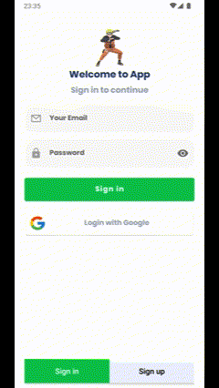

<h1 align="center">Anime List</h1> 

  
An android application that uses <a href="https://docs.api.jikan.moe">Jikan API</a>  to display Anime. it has been built with Event-Effect-State(EES), BasePaging, Custom Compount View, Repository Pattern, and MVVM pattern as well as Architecture Components.

 

 
  

## Gif

## Screenshots

 
 

## Tech stack & Open-source libraries
- Minimum SDK level 24
- 100% [Kotlin](https://kotlinlang.org/) based + [Coroutines](https://github.com/Kotlin/kotlinx.coroutines) and [Flow](https://developer.android.com/kotlin/flow)
- [Android Architecture Components](https://developer.android.com/topic/libraries/architecture): Collection of libraries that help you design robust, testable, and maintainable apps.
  -  A single-activity architecture, using the [Navigation](https://developer.android.com/guide/navigation): to manage composable transactions.
  - [Lifecycle](https://developer.android.com/topic/libraries/architecture/lifecycle): perform an action when lifecycle state changes
  - [ViewModel](https://developer.android.com/topic/libraries/architecture/viewmodel): Stores UI-related data that isn't destroyed on UI changes. 
  - [UseCases](https://developer.android.com/topic/architecture/domain-layer): Located domain layer that sits between the UI layer and the data layer. 
  - [Repository](https://developer.android.com/topic/architecture/data-layer): Located in data layer that contains application data and business logic.
- [Dependency Injection](https://developer.android.com/training/dependency-injection): Is a design pattern that facilitates the management of dependencies and the integration of components in a flexible, testable, and maintainable manner
- [Android Hilt](https://developer.android.com/training/dependency-injection/hilt-android): Dependency Injection Library
- [Retrofit](https://square.github.io/retrofit/): A type-safe HTTP client for Android and Java
- [OkHttp](https://square.github.io/okhttp/): An HTTP client that efficiently make network requests.
- [Paging3](https://developer.android.com/topic/libraries/architecture/paging/v3-migration): Used to optimize data flow by breaking down large data sets into smaller pieces and loading them only when needed.
- [Custom Compound View](https://www.youtube.com/watch?v=UmjiAIsIDw0&ab_channel=EmreHamurcu): Is a reusable user interface component that combines multiple existing views or components into a single cohesive unit, simplifying usage and management.
- [Firebase Authentication](https://firebase.google.com/docs/auth?hl=tr): is a free service that helps you authenticate users and sign them in to your app.
- [Youtube Player](https://github.com/PierfrancescoSoffritti/android-youtube-player)
  
## Architecture
This app uses [***MVVM (Model View View-Model)***](https://developer.android.com/jetpack/docs/guide#recommended-app-arch) architecture

## Video
https://github.com/BahadirKayis/AnimeList/assets/66027016/d190d227-8d73-4a3a-86b6-d49fc40417ea

